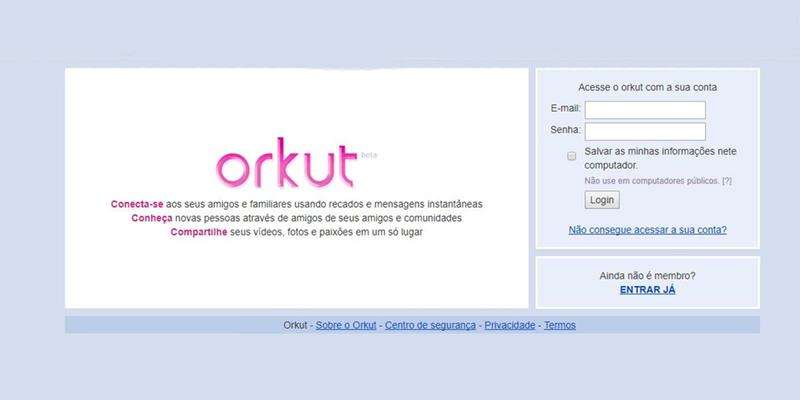
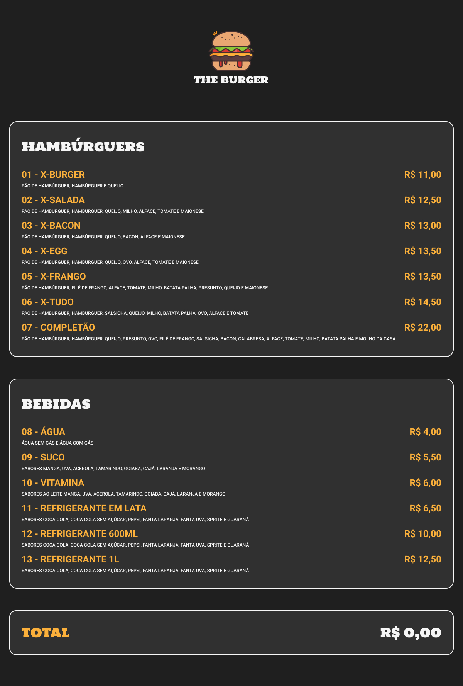

## Conteúdo

- [Tela de Login do Orkut](#projeto1)
- [Um Cardápio Online](#projeto2)
- [Calculadora de Índice de Massa Corpórea (IMC)](#projeto3)
- [Lista de Tarefas](#projeto4)
- [Uma Tabela de Preços](#projeto5)

---

### Tela de Login do Orkut 

Vamos relembrar dos velhos tempos? A meta é criarmos uma página de login simples do Orkut, utilizando o que aprendemos com HTML e CSS até agora. O layout final deverá ficar o mais próximo da versão apresentada acima.

---

### Um Cardápio Online 

Que tal criar um cardápio online relembrando aqueles que vemos nos restaurantes do nosso bairro? O objetivo desse projeto é continuar aprimorando as técnicas de HTML e CSS, aprendendo novas formas de utilizar tipos diferentes de imagens e aprender também a construir um projeto consultando um arquivo Figma que contém informações importantes sobre como as estilizações devem ser feitas com base num design (esse projeto futuramente poderá ser adicionado JavaScript para deixar funcional).

### Calculadora de Índice de Massa Corpórea (IMC) 

### Lista de Tarefas 

### Uma Tabela de Preços 

